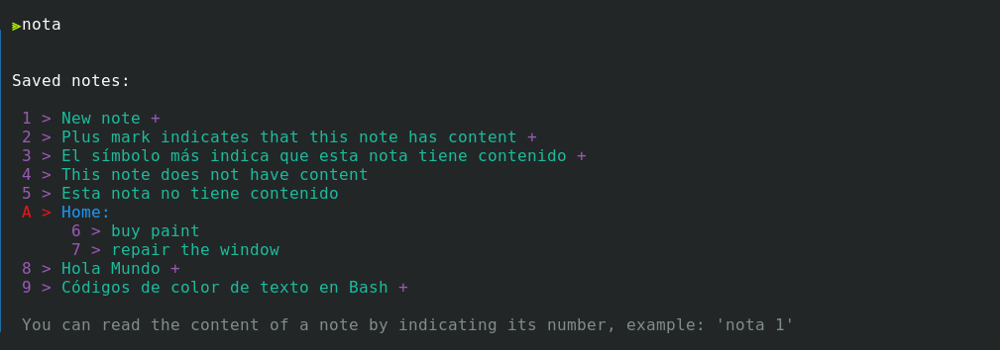
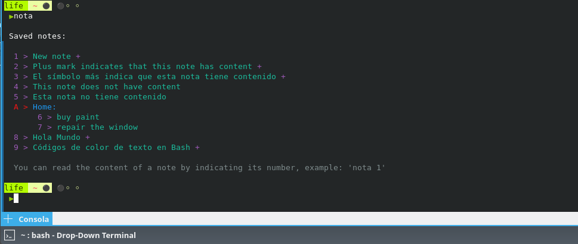
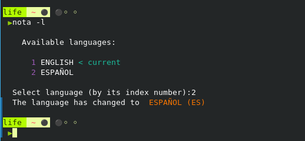
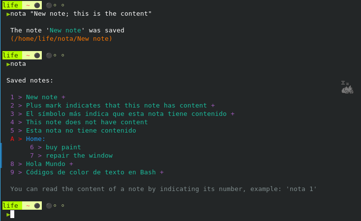
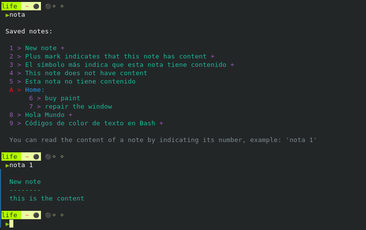
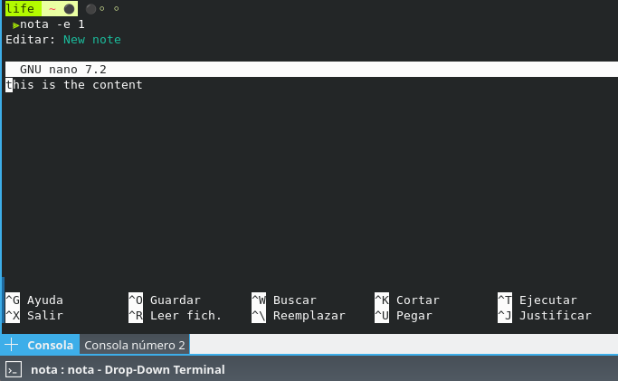
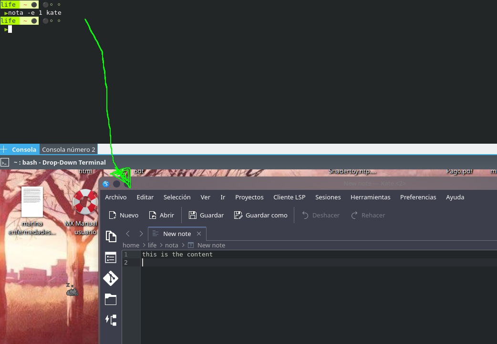

# Nota

EN 🇬🇧: This app/script allows you to take notes in the Linux console and organize them using a simple command. The notes will be available in any terminal and bash session.

ES 🇪🇸: Esta app/script permite tomar notas en la consola linux y organizarlas mediante un simple comando. Las notas estarán disponibles en cualquier terminal y sessión bash.



## Table of Contents / Tabla de Contenidos

- [Features](#Features)
- [Installation / Instalación](#installation--instalación)
- [Usage / Uso](#usage--uso)
- [Contributing / Contribuir](#contributing--contribuir)
- [Screenshots / Capturas de pantalla](#Screenshots--Capturas-de-pantalla)
- [License / Licencia](#license--licencia)

## Features

- 🇬🇧 Can be tested portable (no installation required)
- 🇪🇸 Se puede probar de forma portable (no se requiere instalación)

- 🇬🇧 Can be run from any location once installed
- 🇪🇸 Se puede ejecutar desde cualquier ubicación una vez instalado

- 🇬🇧 Check the list of saved notes, the most recent ones are shown first
- 🇪🇸 Consulta la lista de notas guardadas, se muestran primero las más recientes

- 🇬🇧 Save notes with content (title + content)
- 🇪🇸 Guarda notas con contenido (título + contenido)

- 🇬🇧 Save notes without content (just a title)
- 🇪🇸 Guarda notas sin contenido (sólo un título)

- 🇬🇧 Delete notes
- 🇪🇸 Elimina notas

- 🇬🇧 Edit the content of a note
- 🇪🇸 Edita el contenido de una nota

- 🇬🇧 Edit notes with the default editor (nano) or an external editor (you can edit the .settings file to change the default editor)
- 🇪🇸 Edita notas con el editor por defecto (nano) o un editor externo (puedes editar el file .settings para cambiar el editor por defecto)

- 🇬🇧 Create categories (group of notes)
- 🇪🇸 Crea categorías (grupo de notas)

- 🇬🇧 Rename the title of a note or that of a category
- 🇪🇸 Renombre el título de una nota o el de una categoría

- 🇬🇧 Move notes within a category
- 🇪🇸 Mueve notas dentro de una categoría

- 🇬🇧 Shows the path to the file that represents (contains) a note
- 🇪🇸 Muestra la ruta al archivo que representa (contiene) una nota

- 🇬🇧 Raise a note to be displayed first
- 🇪🇸 Eleva una nota para que se muestre en primer lugar

- 🇬🇧 Easily transportable notes (just copy and paste)
- 🇪🇸 Notas fácilmente transportables (sólo copiar y pegar)

- 🇬🇧 Support for more than one language (Spanish and English for now, you can add your own language)
- 🇪🇸 Soporte para más de un lenguaje (Español e Inglés por ahora, puedes añadir tu propio idioma)

<br>

🇬🇧 Notes are saved in the same directory where the script is located (if it is not installed)
🇪🇸 Las notas se guardan en el mismo directorio donde se encuentra el script (si no está instalado)

🇬🇧 Notes are saved within a directory on the user's Home (\~/note) (if the script is installed)
🇪🇸 Las notas se guardan dentro de un directorio en el Home del usuario (\~/nota) (si el script está isntalado)


## Installation / Instalación

Download a zip or clone the repo / Descarga un zip o clona el repositorio:

```shell
git clone https://github.com/tebicap/nota

```
Enter to the new folder 'nota' / Entra a la nueva carpeta 'nota'

```shell
cd nota

```
Give execute permissions to the script 'nota.sh' / Da permisos de ejecución al script 'nota.sh'

```shell
chmod +x nota.sh

```

To install run /  Para instalar ejecuta:

```shell
./nota.sh install

# (you will be asked for superuser password to copy the script)
# (se te pedirá contraseña de superusuario para copiar el script)
```

Or run the program portablely / O ejecuta el programa de forma portable

```shell
./nota.sh

```

Estos son los archivos que se van a instalar automáticamente:

- nota.sh  >  **'/usr/local/bin/nota'**
- **'~/nota'**  (a new folder in HOME if it doesn't exists, existing notes will not be deleted / Creación de nueva carpeta en HOME, no se borrarán notas ya existentes)
- .settings  >  **'~/nota/.settings'**
- .language_EN  >  **'~/nota/.language_EN'**
- .language_ES  >  **'~/nota/.language_ES'**
- .language_...

## Usage / Uso

🇬🇧 ENGLISH: 🇬🇧

Check the list of notes like this: `nota`<br>
> Notes are always displayed in order of creation (most recent first)<br>
> Each note has a number with which to manipulate them, and each category a letter

Check the content of a note by indicating its number: `nota 1`<br>

Add a simple note like this: `nota My first note` (you can use quotes or not)<br>
Add a note with content like this: `nota "Title of the note; Content of the note after the semicolon, all in quotes"`<br>
Add a category (to group notes) with a double semicolon at the end: `nota "Urgent tasks;;"`

Move a note within a category by pointing to note number + category letter: `nota 1 B` (move note number 1 to category B, you can use lowercase)

Delete a note or category like this: `nota -d 1` (it will be a letter if you want to delete a category)<br>
> It can also be removed with: `-d -del -delete -r -remove`

Edit a note like this: `nota -edit 1`  (edit note 1)<br>
> You can also use `-e edit`

Edit a note with any text editor like this: `nota -edit 1 kate` (edit note 1 with the Kate text editor)<br>
> You can also use `-e edit`

Rename the title of a note or category (group of notes) like this: `nota -rename 1`  (rename note 1)<br>
> You can also use `-name`

Show note's path like this: `nota -path 1` (the path will be printed)<br>
> You can also use `-p path`

Open file browser in the notes directory like this: `nota -browser`<br>
> You can also use `-b -fb`

Elevate a note like this: `nota -touch 4`<br>
> You can also use `-t -up -u`

List and/or change available languages like this: `nota -language`<br>
> You can also use `-l -lang`

Consult this guide with: `nota --help`  (or -h; -help; help)

SAY '**THANK YOU**' BY SENDING BITCOIN ⚡ <br>
https://coinos.io/estebanc
-
- Or Paypal: https://www.paypal.com/donate/?hosted_button_id=DTG94EYGCN5PG


-----


🇪🇸 ESPAÑOL: 🇪🇸

Consulta la lista de notas así: `nota`<br>
> Las notas siembre se muestran por orden de creación (primero las más recientes)<br>
> Cada nota tiene un número con el que poder manupularlas, y cada categoría una letra

Consulta el contenido de una nota señalando su número: `nota 1`

Añade una nota simple así: `nota Mi primer nota` (puedes usar comillas o no)<br>
Añade una nota con contenido así: `nota "Título de la nota; Contenido de la nota después del semicolon, todo entre comillas"`<br>
Añade una categoría (para agrupar notas) con doble punto y coma al final: `nota "Tareas urgentes;;"`

Mueve una nota dentro de una categoría señalando número de nota + letra de categoría: `nota 1 B` (mueve la nota número 1 a la categoría B, puedes usar minúsculas)<br>

Elimina una nota o categoría así: `nota -d 1` (será una letra si quieres eliminar una categoría)<br>
> También se puede eliminar con: `-d -del -delete -r -remove`

Edita una nota así: `nota -edit 1` (edita la nota 1)<br>
> También puedes usar `-e editar`

Edita una nota con cualquier editor de texto así: `nota -edit 1 kate`  (edita la nota 1 con el editor de texto Kate)<br>
> También puedes usar `-e editar`

Renombra el título de una nota o categoría (grupo de notas) así: `nota -rename 1`  (renombra la nota 1)<br>
> También puedes usar `-name`

Muestra la ruta de la nota así: `nota -path 1` (the path will be printed)<br>
> También puedes usar `-p -ruta ruta`

Abra el explorador de archivos en el directorio de notas así: `nota -browser`<br>
> También puedes usar `-b -fb`

Eleva una nota así: `nota -touch 4`
> También puedes usar `-t -up -u `

Lista y/o cambia idiomas disponibles así: `nota -language`<br>
> También puedes usar `-l -lang`

Consultar esta guía con: `nota --help`  (or -h; -help; ayuda)


### DI '**GRACIAS**' ENVIANDO BITCOIN ⚡ <br>
https://coinos.io/estebanc
-
- Or Paypal: https://www.paypal.com/donate/?hosted_button_id=DTG94EYGCN5PG


## Contributing / Contribuir

🇬🇧 Help me translate this app into your language, to do this you can make a copy of any language file (.language_XX):
Ayúdame a traducir esta app a tu idioma, para ello puedes hacer una copia de cualquier fichero de idiomas (.language_XX):

1
- 🇬🇧 Edit the file name to indicate the new language
- 🇪🇸 Edita el nombre del fichero para indicar el nuevo idioma

2
- 🇬🇧 Edit the first line of the file, replacing the original language with the new one, in capital letters.
- 🇪🇸 Edita la primer línea del fichero reemplazando el idioma original por el nuevo, en mayúsculas.

3
- 🇬🇧 Edit each variable with the translation (keeping the reference text in English)
- 🇪🇸 Edita cada variable con la traducción (manteniendo el texto de referencia en inglés)

4
- 🇬🇧 Submit the file to the repository to share it with others
- 🇪🇸 Añade el fichero al repositorio para compartirlos con otros

----

## Screenshots / Capturas de pantalla

🇬🇧 Printing note list<br>
🇪🇸 Imprimiendo lista de notas:<br>


🇬🇧 Changing language<br>
🇪🇸 Cambiando idioma:<br>


🇬🇧 Taking a note with content<br>
🇪🇸 Tomando una nota con contenido:<br>


🇬🇧 Viewing note content<br>
🇪🇸 Viendo el contenido de una nota:<br>


🇬🇧 Editing a note with the default editor (setted in '.settings' file)<br>
🇪🇸 Editando una nota con el editor predeterminado (seteado en el archivo '.settings'):<br>


🇬🇧 Editing a note with a different editor (Kate in this case)<br>
🇪🇸 Editando una nota con un editor diferente (Kate en este caso):<br>


---

### Author: Esteban Capella (estebancapella.dg@gmail.com)
### Date: Nov 2023
### Description: take notes in bash

SAY '**THANK YOU**' BY SENDING BITCOIN ⚡ <br>
https://coinos.io/estebanc
-
- Or Paypal: https://www.paypal.com/donate/?hosted_button_id=DTG94EYGCN5PG
